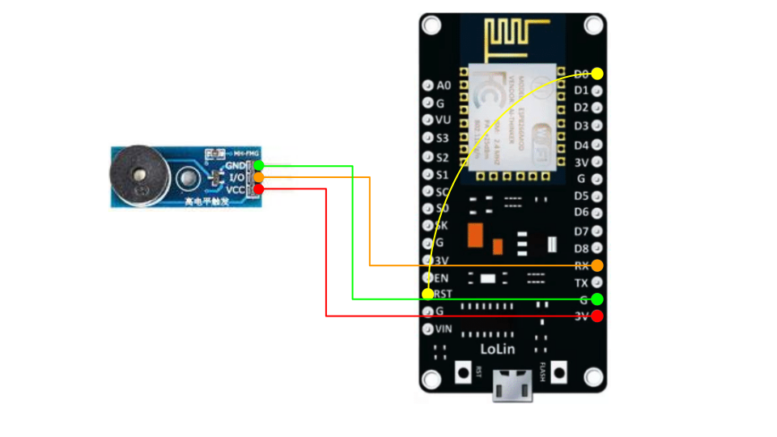
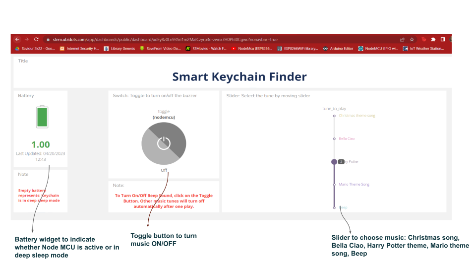
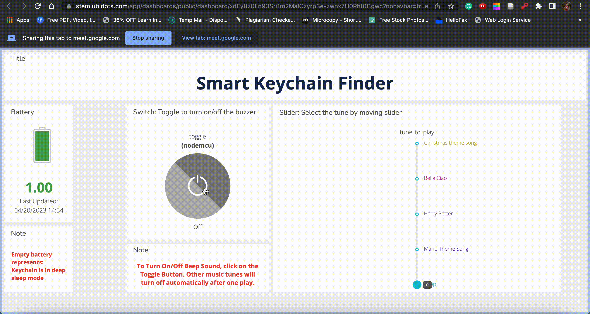

# Smart Keychain

Krishna Bansal, Jitesh Jain

[`Slides`](https://docs.google.com/presentation/d/1wEGLdPJRN7Ao_xidERvoA_JeyREvPERM2uB3gNognCo/edit#slide=id.p) [`Demo`](https://drive.google.com/file/d/1AkTNnDjuiKDXiTWCKV1JOgtfXFBcJ5V3/view?usp=share_link)

This is a simple project to build a smart keychain that will help you to locate your keys with ease. The project uses an ESP8266 board and an active buzzer to make a sound when the keys are nearby.

## Contents

- [Components Required](#components-required)
- [Schematic Diagram](#schematic-diagram)
- [Circuit Diagram](#circuit-diagram)
- [Software Setup](#software-setup)
- [How It Works](#how-it-works)
- [Usage Instructions](#usage-instructions)

## Components Required

### Hardware

- ESP8266 board
- Active Buzzer
- Jumper Wires
- USB Cable
- Battery

### Software

- Arduino IDE
- Ubidots account for data publishing and hosting the webpage
- Libraries:
  - UbidotsESPMQTT.h
  - pitches.h

## Schematic Diagram

### Making the Connections

1. Connect the VCC of the active buzzer to the 3.3V of the ESP8266 board.
2. Connect the GND of the active buzzer to the GND of the ESP8266 board.
3. Connect the I/O of the active buzzer to the D8 pin of the ESP8266 board.
4. Connect the RST to the D0 of the ESP8266 board to enable sleep mode.

We don't show the battery connections in the schematic diagram. Please refer to the [circuit diagram](#circuit-diagram) for more information.

## Circuit Diagram

## Software Setup

1. Create an account on the Ubidots website (<https://ubidots.com/>).
2. Create a new device (named **"nodemcu"**) on the Ubidots platform and add new variables (**"toggle"**, **"tune_to_play"**, **"is_sleeping"**). Take note of the following values:
    - TOKEN: your Ubidots token.
    - WIFI_NAME: your WiFi network's name.
    - WIFI_PASSWORD: your WiFi network's password.
3. Now open the Ubidots Dashboard and create widgets corresponding to each variable:
    - Switch button (In control section) for variable toggle
    - Slider (In control section) for variable tune_to_play
    - Battery (In metrics section) for variable is_sleeping
4. Open the Arduino IDE and install the required libraries.
5. Copy and paste the code from [src/code.ino](src/code.ino) into a new sketch.
6. Replace the following values in the code with your own:
    - TOKEN
    - WIFI_NAME
    - WIFI_PASSWORD
7. Upload the code to the ESP8266 board.
8. Open the Serial Monitor to see the status of the board.
9. Control the smartkey using the Ubidots dashboard.
10. To convert the dashboard into a public webpage make the dashboard visibility public by sharing it.

## How it Works

The ESP8266 sends MQTT request to Ubidots server for sending and recieving variables' values. Whenever toggle button is pressed, callback function is being called in the code that is responsible for reading the button state and performing corresponding actions. Same goes for slider, whose value is read in callback function and corresponding tune is being played on NodeMCU. After every 40 seconds, Keychain goes into deep sleep mode for 20 seconds. Whenever, it switches its mode code sends the battery status to Ubidots being shown as green for active mode and red for sleep mode. Beep sound can be turned ON/OFF whenever we want. Rest of the melodies can be turned on by preference but they will turn OFF only when they are fully played.

The ESP8266 based smartkey has a buzzer which can be activated by clicking on the toggle button on a webpage hosted on the internet using Ubidots. The ESP8266 board is connected to the WiFi. The webpage also contains various choices of different sounds to play upon activation of the buzzer. It shows a battery widget in leftmost corner indicating whether Keychain is active or in deep_sleep mode.

## Usage Instructions

1. Connect your computer or mobile device to the WiFi network.
2. Open the webpage hosted on the internet using link: [here](https://stem.ubidots.com/app/dashboards/public/dashboard/xdEy8z0Ln93Sri1m2MaICzyrp3e-zwnx7H0Pht0Cgwc?nonavbar=true).
3. Activate the buzzer using the toggle button on the webpage. Choose the music of your choice using slider.
4. Nothing on webpage will work(toggle button, slider) if battery is low (indicated as red).
5. Beep sound is controllable from toggle button, i.e can be turned on/off whenever toggle button is pressed.
6. For other music tunes, we can turn them on using toggle button but they will turn off only after they are played once completely and hence can’t be turned off in between using toggle or slider.
   - If you pressed toggle off when music is playing, it will turn off after one complete play.
   - If you moved the slider to music B when music A is already playing, then next song will be played only after music A ends.
7. If anywhere during whole operation battery goes down, then everything will turn off and will resume from the point it was being left once battery turns up again.

A demo video can be found [here](https://drive.google.com/file/d/1AkTNnDjuiKDXiTWCKV1JOgtfXFBcJ5V3/view?usp=share_link).

## Acknowledgements

https://docs.ubidots.com/v1.6/reference/mqtt-authentication